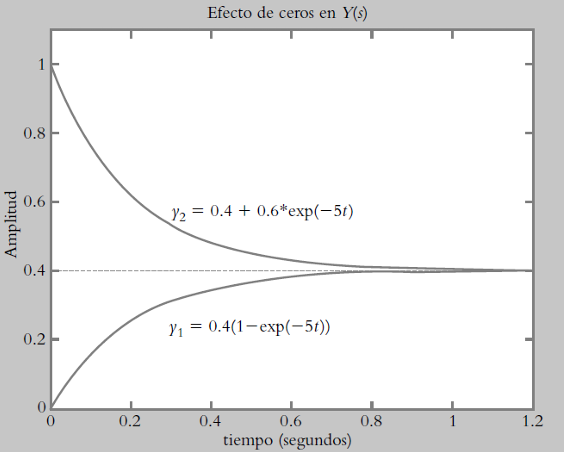

# Sistemas de segundo orden
Daniel Felipe Ladino, Angel David Melo

Se le conoce como los sistemas que tienen dos polos en su funcion de transferencia.
Estos sistemas tienen la siguiente estructura:

$$\frac{\mathrm{d^{2}} y(t)}{\mathrm{d} t^{2}}+a_{1}\frac{\mathrm{d} y(t)}{\mathrm{d} t}+a_{0}y(t)=b_{0}u(t)$$

Para encontrar la funcion de trasferencia de estos sistemas se siguen los siguientes pasos:
Primero se aplica transformada de Laplace a la ecuacion

$$s^{2}Y(s)+a_{1}sY(s)+a_{0}Y(s)=b_{0}U(s)$$

Despues se despeja la ecuacion para obtener la funcion de transferencia

$$\frac{Y(s)}{U(s)}=\frac{b_{0}}{s^{2}+a_{1}s+a_{0}}$$

## Forma canonica  
$$G(s) = \frac{K \omega_n^2}{s^2 + 2\zeta\omega_n s + \omega_n^2}$$  

### Parámetros Clave:  
- **K**: Ganancia estática.  
- **ωₙ**: Frecuencia natural (rad/s).  
- **ζ**: Factor de amortiguamiento.  

---

## 1. Respuesta al Escalón  
### Comportamiento según ζ:  
| **Condición**       | **Tipo de Respuesta**       | **Características**                |  
|---------------------|----------------------------|-----------------------------------|  
| $$\(\zeta < 1\)$$       | Subamortiguada             | Oscilaciones decrecientes.        |  
| $$\(\zeta = 1\)$$      | Críticamente amortiguada   | Respuesta rápida sin oscilaciones.|  
| $$\(\zeta > 1\)$$       | Sobreamortiguada           | Respuesta lenta sin oscilaciones. |  

### Ejemplo:  
$$G(s) = \frac{36}{s^2 + 4.2s + 36}$$ 
- $$\(\omega_n = 6 \, \text{rad/s}\), \(\zeta = 0.35\)$$ (subamortiguado).  

---

## 2. Parámetros Temporales (Subamortiguado)  
- **Tiempo pico $$(\(t_p\))$$**:  
  $$\ t_p = \frac{\pi}{\omega_n \sqrt{1-\zeta^2}} \$$  
- **Sobrepaso (\(M_p\))**:  
  $$M_p = e^{-\frac{\zeta \pi}{\sqrt{1-\zeta^2}}}$$ 
- **Tiempo de establecimiento $$(\(t_s\))$$**:  
  - 2% de tolerancia: $$\( t_s \approx \frac{4}{\zeta \omega_n} \)$$.  
  - 5% de tolerancia: $$\( t_s \approx \frac{3}{\zeta \omega_n} \)$$.  

---

## 3. Efecto de Ceros y Polos Dominantes  
- **Ceros**: Afectan solo el transitorio (no el estado estacionario).  
  - Ejemplo:  
    $$Y_1(s) = \frac{2}{s(s+5)} \quad \text{vs.} \quad Y_2(s) = \frac{s+2}{s(s+5)}$$
    
    - Aplicamos fraciones parciales
    
$$y_1 = 0.4(1 - e^{-5t})$$
$$y_2 = 0.4 + 0.6e^{-5t}$$

- **Polos dominantes**: Determinan el comportamiento transitorio. Polos cercanos al eje imaginario dominan.  

---
