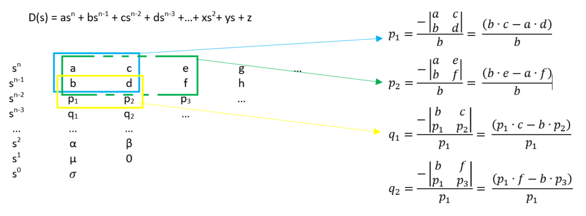

# Estabilidad
Un sistema lineal o invariante en el tiempo es estable si su respuesta en condiciones naturales tiene a cero en un tiempo indefinido y para que este tipo de sistema sea inestable su respuesta debe crecer ilimitadamente en un tiempo indefinido.
## Teorema del valor final
Esta herramienta nos permite saber cual es el valor del sistema que estamos trabajando en estado estacionario. sin embargo, esto solo funciona cuando el sistema es estable.
Para lograr esto se trabaja bajo el dominio de Laplace siguiendo la siguiente identidad:

$$\displaystyle \lim _ {t \to \infty  } f(t)=\displaystyle \lim_{s \to 0} sF(s)$$

##ejemplo
Para demostrar el funcionamiento de este teorema proponemos la siguiente funcion de transferencia para evaluar la estabilidad de este sistema con una entrada especifica.

$$G(s)=\frac{Y(s)}{U(s)}=\frac{6}{7s+3}$$

$$Y(s)=\frac{6 \cdot U(s)}{7s+3}$$

procedemos a utilizar la identidad mostrada anteriormente donde U(s) es reemplazado segun la entrada que se este trabajando ya sea entrada rampa, escalon o de tipo senoidal. En este caso se utilizara la entrada tipo escalon.

$$\displaystyle \lim_{t \to \infty }sY(s)=\displaystyle \lim_{s \to 0} s\cdot \frac{6\cdot \frac{1}{s}}{7s+3}$$

## Analisis de estabilidad por ubicacion
Para determinar si un sistema dinamico es estable o no, se puede determinar su estado encontrando los polos dominantes del sistema.Usando esto podemos determinar el comportamiento del sistema por medio de las siguientes condiciones:

1. Si alguno de los polos se encuentran al lado derecho de la grafica el sistema es inestable. 

2. Todos los polos del sistema deben estar en el lado izquiero para que el sistema sea estable.

## Ejemplo
Para demostrar su funcionamiento se hara una breve demostracion con la siguiente funcion de transferencia:

$$G(s)=\frac{7s}{6s+1}\to 6s+1=0\to s=-\frac{1}{6}$$

# Ubicaion de polos 
Con ayuda de este sistema podemos verificar si un sistema es estable o no, para esto se deben cumplir lass condiciones estipuladas en el analisis de estabilidad por ubicacion. Es decir, todos los polos deben tener parte real negativa.
De lo contrario su sistema es considerado inestable con tan solo un polo que tenga parte real positiva.
## ejemplo 2
Tenemos la siguiente funcion de transferencia: 

$$G(s)=\frac{8}{2s+1}$$

Nos centramos en el denominador y resolvemos:

$$2s+1=0$$

$$s=-\frac{1}{2}$$

## Ejemplo 2

Tenemos la siguiente funcion de transferencia:

$$G(s)=\frac{8}{s^{2}-0.1s+1}$$

Nos centramos en el denominador

$$s^{2}-0.1s+1$$

$$s_{1}=0.05+j0.9987$$

$$s_{2}=0.05-j0.9987$$

## Criterio de Routh-Hurwitz
Para poder decir que se tiene un pilonomio de hurwitz sus raices deben tener parte real negativa. Este criterio permite identificar estos polinomios de una manera mas sencilla siempre y cuando tenga la siguiente forma:

$$a_{0}s^{n}+a_{1}s^{n-1}+...+a_{n-1}s+a_{n}=0$$

Teniendo esta forma se procede a seguir unos criterios para determinar si el sistema es de hurwitz:
cada coeficiente debe ser positivo, si uno de los coeficientes es cero no es un polinomio de hurwitz.
siguiendo estas normas puede que el polinomio sea de hurwitz.
Esto se deterina de la siguiente manera:

## ejemplo
Tenemos el siguiente polinomio:

$$s^{3}+s^{2}+2s+24=0$$

Verificamos si cumple con los requisitos y nos disponemos a realizar las  debidas operaciones:

$$b_{1}=\frac{2-24}{1}=-22$$

$$b_{1}=\frac{(-22)(24)-(1)(0)}{-22}=24$$

# Diseño de controlador para garantizar estabilidad
# Ejercicio 1
Tenemos la siguiente funcion de transferencia:

$$G(s)=\frac{1}{s^{4}+s^{3}+3s^{2}+2s}$$

Se plantea la ecuacion para el controlador:

$$G_{o}(s)=\frac{K_{p}}{s^{4}+s^{3}+3s^{2}+2s+k_{p}}$$

Procedemos a aplicar criterio de hurwitz

$$b_{1}=\frac{(3)(3)-(1)(2)}{3}=\frac{7}{3}$$

$$b_{2}=\frac{(3)(k_{p})-(1)(0)}{3}=k_{p}$$

$$c_{1}=\frac{(\frac{7}{3})(2)-(3)(k_{p})}{\frac{7}{3}} = \frac{\frac{14}{3}-3k_{p}}{\frac{7}{3}}$$

$$c_{1}=\frac{\frac{\frac{14}{3}-3k_{p}}{\frac{7}{3}}\cdot k_{p}-(\frac{7}{3})(0)}{\frac{\frac{14}{3}-3k_{p}}{\frac{7}{3}}}$$

# Ejercicios
## ejercicio #1
Tenemos la siguiente ecuacion diferencial:

$$s^{4}+8s^{3}+26s^{2}+16s+22$$

Primeramente verificamos que cumpla con los requisitos. Como se puede ver todos los coeficientes son positivos y ninguno  de ellos es cero por lo tanto podemos seguir con el procedimiento. obteniendo los siguientes resultados:

$$\begin{bmatrix}
 s^{4}: & 1 & 26 & 22 \\
 s^{3}: & 8 & 16 & 0  \\
 s^{2}: & 24 & 22 & 0  \\
 s^{1}: & 16-\frac{176}{24} & 0 & 0  \\
 s^{0}: & 22 & 0 & 0  \\
\end{bmatrix}$$

Como se puede ver en la primera colunma todos no hay cambio de signo o algun elemento es cero. por lo tanto el sistema es estable.

## Ejercicio #2

Tenemos la siguiente ecuacion diferencial:

$$s^{3}+10s^{2}+5s+k$$

Para empezar nos aseguramos que el sistema cumpla con los requisitos, todos los coeficientes son positivos y ninguno de ellos valen cero. Sabiendo esto podemos seguir con el procedimiento obteniendo los siguientes resultados.

$$\begin{bmatrix}
s^{3}: & 1 & 5 \\
s^{2}: & 10 & k \\
s^{1}: & \frac{50-k}{10} & 0 \\
s^{0}: & k &  \\
\end{bmatrix}$$

Como se puede ver, para que el sistema sea estable entonces 50-k>0 y K>0 para que el sistema sea estable.
